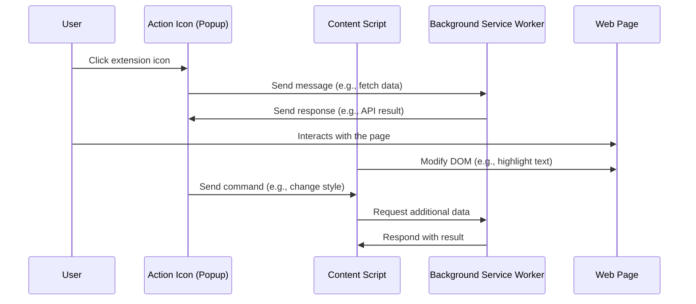

---
# You can also start simply with 'default'
theme: default
background: https://images.unsplash.com/photo-1488554378835-f7acf46e6c98?q=80&w=2942&auto=format&fit=crop&ixlib=rb-4.0.3&ixid=M3wxMjA3fDB8MHxwaG90by1wYWdlfHx8fGVufDB8fHx8fA%3D%3D
# some information about your slides (markdown enabled)
title: Extensions, Level Up Your Browser
info: |
  Extensions, Level Up Your Browser by Jalu Wibowo Aji
# apply unocss classes to the current slide
class: text-center
# https://sli.dev/features/drawing
drawings:
  persist: false
# slide transition: https://sli.dev/guide/animations.html#slide-transitions
transition: fade-out
# enable MDC Syntax: https://sli.dev/features/mdc
mdc: true
---

# **Extensions: Level Up Your Browser**

<!--
- greeting
- say thanks for coming
- say the title and what will i deliver in this 50 minutes
-->

---
transition: fade-out
layout: center
---

# **About Me 👋**

<div class="grid grid-cols-2 gap-16">
  <div class="flex flex-col">
  <h4 class="text-lg -mb-4">Jalu Wibowo Aji</h4>
  <p class="text-sm text-gray-400">Software Engineer Frontend at <a href="https://sekolah.mu" target="_blank">Sekolah.mu</a></p>

  <div class="list-none text-sm mt-4">
    <li>
      <a href="https://github.com/jarooda" target="_blank" class="slidev-btn">
        <carbon:logo-github /> jarooda
      </a>
    </li>
    <li>
      <a href="https://t.me/jaluwibowo" target="_blank" class="slidev-btn">
        <logos:telegram /> jaluwibowo
      </a>
    </li>
    <li>
      <a href="https://github.com/jarooda" target="_blank" class="slidev-btn">
        <carbon:earth-southeast-asia /> jaluwibowo.id
      </a>
    </li>
  </div>
  </div>
  
</div>

<!--
intro, name, role and squad

want to collaborate: github
want to chat: telegram
-->

---
layout: image
image: https://img.devrant.com/devrant/rant/r_2467532_539j1.jpg
backgroundSize: contain
---

<!--
1. Tampilkan Gambar
🎤 "Coba lihat gambar ini sebentar…" (Tunggu beberapa detik agar audiens melihat gambar dan bereaksi.)

2. Buka dengan Relatable Statement
🗣️ "Jadi, kita sebagai tech worker pasti nggak lepas dari yang namanya browsing ataupun Googling."

3. Transisi ke Pertanyaan
💡 "Dan teman-teman sendiri pasti sudah sering pakai…?" (Berhenti sejenak, biarkan audiens berpikir.)

next slide ->
-->

---
layout: center
class: text-center
transition: fade-out
---

# **What Browser Extensions Do You Use? 🧐**

Please share in the chat.


<style>
img {
  width: 100px;
  height: auto;
}
</style>

<!--
👉 “…Browser extensions!”

4. Ajakan Berinteraksi
🤔 "Nah, kalau boleh tahu, teman-teman di sini biasanya pakai extension apa aja?" (Arahkan ke audiens untuk membuka diskusi.)

-> curhat

Kalau aku, yang paling kepakai itu "Google Meet Auto Disable Mic/Cam"
-->

---
layout: center
class: text-center
transition: fade-out
---

# **What is Browser Extension? 🤔**

A browser extension is a software module for customizing a web browser.

<div class="abs-bl m-6 text-sm text-slate-500">
  source: <a href="https://en.wikipedia.org/wiki/Browser_extension" target="_blank">Wikipedia</a>
</div>

<!--
Browser Extension adalah software kecil yang menambahkan fungsionalitas atau fitur tambahan ke web browser. Extension ini dapat mengubah tampilan, perilaku, atau menambahkan alat baru ke dalam pengalaman browsing pengguna.
-->


---
transition: fade-out
layout: center
---

<div class="flex justify-center items-center">
  
</div>

<div class="abs-bl m-6 text-sm text-slate-500">
  source: <a href="https://www.reddit.com/r/nostalgia/comments/xbehqk/2000s_internet_explorer_spyware_toolbars/" target="_blank">Reddit</a>
</div>

<!--
Internet Toolbar hell, setiap install aplikasi kalau ga aware bisa nambah toolbar di internet explorer
-->

---
transition: fade-out
layout: center
---

# **History 🏛️**

<History class="mt-4" />

<!--
Setelah tahu apa itu browser extension, coba deh kita cek dulu sejarahnya

Pada awalnya, browser extension hadir dalam bentuk toolbar di Internet Explorer (IE). Contohnya:
🔹 Google Toolbar (2000) – Memudahkan pencarian langsung dari browser.
🔹 Yahoo! Toolbar, Ask Toolbar, Babylon Toolbar – Banyak toolbar ini sering kali disertakan dalam software lain dan sulit dihapus, menyebabkan pengalaman pengguna yang buruk.
🔹 Masalah utama: Toolbar sering kali memperlambat browser dan memiliki celah keamanan.

-

Mozilla Firefox memperkenalkan sistem add-ons, yang lebih fleksibel dan memberikan kontrol lebih kepada pengguna.
🔹 Dibangun menggunakan XUL (XML User Interface Language) yang sekarang sudah menjadi legacy dan dibangun dengan WebExtensions API.
🔹 Memungkinkan pengguna untuk menginstal ekstensi yang lebih modular dan tidak mengganggu UI browser.

-

Pada tahun 2008, Google meluncurkan Chrome dengan sistem ekstensi yang lebih sederhana dan berbasis HTML, CSS, dan JavaScript.
🔹 Chrome memperkenalkan Manifest V1, yang mengatur bagaimana ekstensi dibuat dan beroperasi.
🔹 Banyak ekstensi mulai dikembangkan untuk meningkatkan pengalaman browsing.

Pada tahun 2013, Google memperkenalkan Manifest V2, yang lebih aman dan membatasi beberapa akses ekstensi untuk menghindari penyalahgunaan.

-

Google mengumumkan Manifest V3 (MV3) pada tahun 2020 sebagai pembaruan besar untuk meningkatkan keamanan dan privasi.
🔹 Fokus utama:
✅ Mengurangi akses ekstensi ke data pengguna.
✅ Memblokir penggunaan background scripts yang berjalan terus-menerus.
✅ Menggantikan WebRequest API dengan DeclarativeNetRequest, yang membatasi pemblokiran iklan seperti yang dilakukan oleh uBlock Origin.

Kontroversi Manifest V3:
❌ Beberapa pengembang dan komunitas open-source menilai perubahan ini membatasi fleksibilitas ekstensi, terutama untuk ekstensi pemblokiran iklan.
❌ Ekstensi seperti uBlock Origin harus mencari cara baru agar tetap berfungsi dengan baik di Chrome.

Namun, browser lain seperti Mozilla Firefox dan Microsoft Edge tetap mendukung Manifest V2 lebih lama untuk menjaga kompatibilitas.

-

Mozilla Firefox memperkenalkan sistem add-ons, yang lebih fleksibel dan memberikan kontrol lebih kepada pengguna.
🔹 Dibangun menggunakan XUL (XML User Interface Language).
🔹 Memungkinkan pengguna untuk menginstal ekstensi yang lebih modular dan tidak mengganggu UI browser.
🔹 Beberapa ekstensi populer saat itu:
✅ Adblock Plus (pemblokiran iklan)
✅ Firebug (alat debugging web sebelum DevTools ada)

-

Pada tahun 2008, Google meluncurkan Chrome dengan sistem ekstensi yang lebih sederhana dan berbasis HTML, CSS, dan JavaScript.
🔹 Chrome memperkenalkan Manifest V1, yang mengatur bagaimana ekstensi dibuat dan beroperasi.
🔹 Banyak ekstensi mulai dikembangkan untuk meningkatkan pengalaman browsing.
🔹 Contoh ekstensi populer di era ini:
✅ LastPass (pengelola kata sandi)
✅ Grammarly (pemeriksa tata bahasa)
✅ Dark Reader (mode gelap untuk semua situs)

Pada tahun 2013, Google memperkenalkan Manifest V2, yang lebih aman dan membatasi beberapa akses ekstensi untuk menghindari penyalahgunaan.
-->

---
transition: fade-out
layout: center
---

# **Chrome Extensions Under The Hood 🥷**

<!-- Pernah ga sih, pakai chrome extension terus kepikiran gimana cara buatnya? -->

---
layout: image
image: /under-the-hood.jpg
backgroundSize: contain
---

---
transition: fade-out
layout: center
---

# **manifest.json**

The `manifest.json` file is the only file that every extension using WebExtension APIs must contain.

<div class="w-full flex justify-center mt-8">
  
</div>

<!--
Dengan manifest.json, kamu bisa menentukan metadata tentang extension yang kamu buat misal nama, logo dan deskripsi, kamu juga bisa menentukan aspek apa saja yang digunakan oleh extension yang kamu buat tersebut (such as background scripts, content scripts, and browser actions).
-->

---
transition: fade-out
layout: two-cols
---

<style>
pre.shiki-magic-move-container {
  white-space: pre-wrap !important;
}
</style>

# **Inside manifest.json 📝**

````md magic-move {lines: true}
```json {*|2-4|*}
{
  "manifest_version": 3,
  "name": "Minimal Manifest",
  "version": "1.0.0",
  "description": "A basic example extension with only required keys",
  "icons": {
    "48": "images/icon-48.png",
    "128": "images/icon-128.png"
  },
}
```

```json {*|10-19}
{
  "manifest_version": 3,
  "name": "Run script automatically",
  "version": "1.0.0",
  "description": "Runs a script on www.example.com automatically when user installs the extension",
  "icons": {
    "48": "images/icon-48.png",
    "128": "images/icon-128.png"
  },
  "content_scripts": [
    {
      "js": [
        "content-script.js"
      ],
      "matches": [
        "http://*.example.com//"
      ]
    }
  ]
}
```

```json {10-19|*}
{
  "manifest_version": 3,
  "name": "Run script automatically",
  "version": "1.0.0",
  "description": "Runs a script on www.example.com automatically when user installs the extension",
  "icons": {
    "48": "images/icon-48.png",
    "128": "images/icon-128.png"
  },
  "content_scripts": [
    {
      "js": [
        "content-script.js"
      ],
      "matches": [
        "<all_urls>"
      ]
    }
  ]
}
```

```json {*|9-20|19}
{
  "manifest_version": 3,
  "name": "Click to run",
  "version": "1.0.0",
  "description": "Runs a script when the user clicks the action toolbar icon.",
  "icons": {
    "48": "images/icon-48.png",
    "128": "images/icon-128.png"
  },
  "background": {
    "service_worker": "service-worker.js"
  },
  "action": {
    "default_icon": {
      "48": "images/icon-48.png",
      "128": "images/icon-128.png"
    }
  },
  "permissions": ["scripting", "activeTab"]
}
```

```json {*|10-18|*}
{
  "manifest_version": 3,
  "name": "Popup extension that requests permissions",
  "version": "1.0.0",
  "description": "Extension that includes a popup and requests host permissions and storage permissions .",
  "icons": {
    "48": "images/icon-48.png",
    "128": "images/icon-128.png"
  },
  "action": {
    "default_popup": "popup.html"
  },
  "host_permissions": [
    "https://*.example.com/"
  ],
  "permissions": [
    "storage"
  ]
}
```

```json {*|10-13|*}
{
  "manifest_version": 3,
  "name": "Side panel extension",
  "version": "1.0.0",
  "description": "Extension with a default side panel.",
  "icons": {
    "48": "images/icon-48.png",
    "128": "images/icon-128.png"
  },
  "side_panel": {
    "default_path": "sidepanel.html"
  },
  "permissions": ["sidePanel"]
}
```
````

::right::

<div class="flex justify-center items-center h-full p-4 relative">
  
  
  
  
  
</div>

<!--
Inside manifest.json the required keys are manifest version, name and version

___

Using content script we

___

Why content_scripts Won't Work for Click-to-Inject
1️⃣ Content scripts are registered statically in manifest.json

"content_scripts" run automatically on pages that match the "matches" filter.
They cannot be injected dynamically when the user clicks the action icon.
2️⃣ Content scripts don't have access to the chrome.* API

Since content scripts run inside web pages, they cannot call chrome.scripting.executeScript to inject additional scripts.
They also cannot detect toolbar icon clicks directly.
3️⃣ No way to conditionally load scripts on user action

Once defined in "content_scripts", they always run on matching pages, instead of only when clicking the icon.
-->

---

# **Example of Chrome Extension Flow 🕸️**



<!--
Explanation of the Diagram:
- User clicks the extension icon → Opens the popup.
- Popup sends a message to the background script → Background script might fetch data from an API.
- Background script sends data back to the popup → Displayed to the user.
- User interacts with a webpage → Content script listens and modifies the DOM.
- Popup sends commands to content script → For example, change page styling.
- Content script communicates with background script → For tasks like API requests.
-->

---
transition: fade-out
layout: center
---

# **Demo 🚀**

Let's Play Around with Browser Extensions!

<!--
1. Creating simple extension to change the cursor when visiting sekolah.mu
2. take a look at pndek.in extension
3. Create extension that boost productivity with chatgpt, and trying to deploy at chrome webstore
-->

---
transition: fade-out
---

# **Security Concerns**
In Chrome Extensions  

##### 1. **Excessive Permissions**
- Some extensions request broad permissions (`<all_urls>`, `"activeTab"`, etc.), which can be exploited.
- Always follow the **principle of least privilege**—grant only necessary permissions.

##### 2. **Malicious Takeovers**
- A legitimate extension can turn malicious if the developer account is hacked or sold. 
- Always verify permissions and ownership before updating an extension.

##### 3. **Data Leaks & Privacy Violations**
- Extensions may track browsing behavior, log keystrokes, or send data to external servers.
- Check the extension’s privacy policy and requested permissions before installing.

<!--
Example: *The Great Suspender* was hijacked and injected with malware.
-->

---

# **Best Practices**  
To Secure Chrome Extensions

✅ Request only the permissions you **absolutely need**.  
✅ Regularly **audit your extension’s code** and dependencies.  
✅ Educate users to **review permissions** before installing.  
✅ Keep developer accounts **secure** to prevent hijacking.  

---
transition: fade-out
layout: center
---

# **Thank You 👋**

Thanks for tuning in! Let’s chat and discuss!
