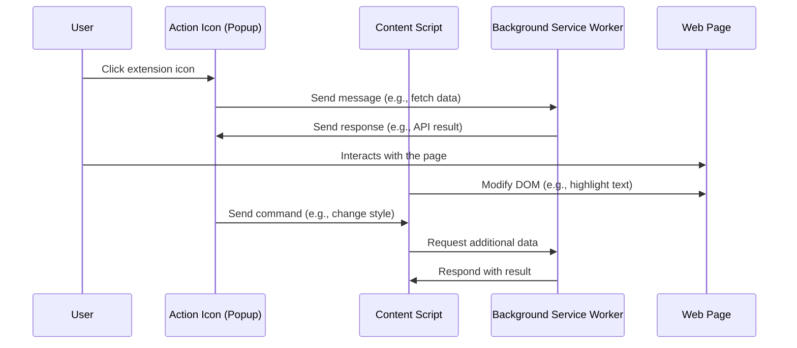

---
# You can also start simply with 'default'
theme: default
background: https://images.unsplash.com/photo-1488554378835-f7acf46e6c98?q=80&w=2942&auto=format&fit=crop&ixlib=rb-4.0.3&ixid=M3wxMjA3fDB8MHxwaG90by1wYWdlfHx8fGVufDB8fHx8fA%3D%3D
# some information about your slides (markdown enabled)
title: Extensions, Level Up Your Browser
info: |
  Extensions, Level Up Your Browser by Jalu Wibowo Aji
# apply unocss classes to the current slide
class: text-center
# https://sli.dev/features/drawing
drawings:
  persist: false
# slide transition: https://sli.dev/guide/animations.html#slide-transitions
transition: fade-out
# enable MDC Syntax: https://sli.dev/features/mdc
mdc: true
---

# **Extensions: Level Up Your Browser**

<!--
- greeting
- say thanks for coming
- say the title
- Sore ini, saya akan membawakan tentang, Extensions: Level Up Your Browser
-->

---
transition: fade-out
layout: center
---

# **About Me 👋**

<div class="grid grid-cols-2 gap-16">
  <div class="flex flex-col">
  <h4 class="text-lg -mb-4">Jalu Wibowo Aji</h4>
  <p class="text-sm text-gray-400">Software Engineer Frontend at <a href="https://sekolah.mu" target="_blank">Sekolah.mu</a></p>

  <div class="list-none text-sm mt-4">
    <li>
      <a href="https://github.com/jarooda" target="_blank" class="slidev-btn">
        <carbon:logo-github /> jarooda
      </a>
    </li>
    <li>
      <a href="https://t.me/jaluwibowo" target="_blank" class="slidev-btn">
        <logos:telegram /> jaluwibowo
      </a>
    </li>
    <li>
      <a href="https://github.com/jarooda" target="_blank" class="slidev-btn">
        <carbon:earth-southeast-asia /> jaluwibowo.id
      </a>
    </li>
  </div>
  </div>
  
</div>

<!--
intro, name, role and squad

want to collaborate: github
want to chat: telegram
you can check my slide in my website
-->

---
layout: image
image: https://img.devrant.com/devrant/rant/r_2467532_539j1.jpg
backgroundSize: contain
---

<div />

<!--
1. Tampilkan Gambar
🎤 "Coba lihat gambar ini sebentar…" (Tunggu beberapa detik agar audiens melihat gambar dan bereaksi.)

2. Buka dengan Relatable Statement
🗣️ "Jadi, kita sebagai tech worker pasti nggak lepas dari yang namanya browsing ataupun Googling."

3. Transisi ke Pertanyaan
💡 "Dan teman-teman sendiri pasti sudah sering pakai…?" (Berhenti sejenak, biarkan audiens berpikir.)

next slide ->
-->

---
layout: center
class: text-center
transition: fade-out
---

# **What Browser Extensions Do You Use? 🧐**

Please share in the chat.


<style>
img {
  width: 100px;
  height: auto;
}
</style>

<!--
👉 “…Browser extensions!”

4. Ajakan Berinteraksi
🤔 "Nah, kalau boleh tahu, teman-teman di sini biasanya pakai extension apa aja?" (Arahkan ke audiens untuk membuka diskusi.)

-> curhat

Kalau aku, yang paling kepakai itu "Google Meet Auto Disable Mic/Cam"
-->

---
layout: center
class: text-center
transition: fade-out
---

# **What is Browser Extension? 🤔**

A browser extension is a software module for customizing a web browser.

<div class="abs-bl m-6 text-sm text-slate-500">
  source: <a href="https://en.wikipedia.org/wiki/Browser_extension" target="_blank">Wikipedia</a>
</div>

<!--
Browser Extension adalah software kecil yang menambahkan fungsionalitas atau fitur tambahan ke web browser. Extension ini dapat mengubah tampilan, perilaku, atau menambahkan tools baru ke dalam pengalaman browsing pengguna.
-->

---
transition: fade-out
layout: center
---

<div class="flex justify-center items-center">
  
</div>

<div class="abs-bl m-6 text-sm text-slate-500">
  source: <a href="https://www.reddit.com/r/nostalgia/comments/xbehqk/2000s_internet_explorer_spyware_toolbars/" target="_blank">Reddit</a>
</div>

<!--
Internet Toolbar hell, setiap install aplikasi kalau ga aware bisa nambah toolbar di internet explorer
-->

---
transition: fade-out
layout: center
---

# **History 🏛️**

<History class="mt-4" />

<!--
Setelah tahu apa itu browser extension, coba deh kita cek dulu sejarahnya

Pada awalnya, browser extension hadir dalam bentuk toolbar di Internet Explorer (IE). Contohnya:
🔹 Google Toolbar, Yahoo! Toolbar, Ask Toolbar, Amazon Toolbar – Memudahkan pencarian langsung dari toolbar tanpa harus membuka website mereka
🔹 Masalah utama: Banyak toolbar ini sering kali disertakan dalam software lain (contohnya waktu install aplikasi dari wizard, yang biasanya pengguna hanya next next saja) dan terkadang sulit dihapus, menyebabkan pengalaman pengguna yang buruk. Toolbar sering kali memperlambat browser dan memiliki celah keamanan.

-

Mozilla Firefox memperkenalkan sistem add-ons, yang lebih fleksibel dan memberikan kontrol lebih kepada pengguna.
🔹 Dibangun menggunakan XUL (XML User Interface Language) yang sekarang sudah menjadi legacy dan dibangun dengan WebExtensions API.
🔹 Addons ini memungkinkan pengguna untuk menginstal ekstensi yang lebih modular dan tidak mengganggu UI browser.

-

Pada tahun 2008, Google meluncurkan Chrome, nah Google Chrome ini mensupport sistem ekstensi yang lebih sederhana dan berbasis HTML, CSS, dan JavaScript.
🔹 Chrome memperkenalkan Manifest V1, yang mengatur bagaimana ekstensi dibuat dan beroperasi.
🔹 Banyak ekstensi mulai dikembangkan untuk meningkatkan pengalaman browsing.

Pada tahun 2013, Google memperkenalkan Manifest V2, yang lebih aman dan membatasi beberapa akses ekstensi untuk menghindari penyalahgunaan.

-

Google meluncurkan Manifest V3 (MV3) pada tahun 2020 sebagai pembaruan besar untuk meningkatkan keamanan dan privasi.
🔹 Fokus utama:
✅ Mengurangi akses ekstensi ke data pengguna.
✅ Memblokir penggunaan background scripts yang berjalan terus-menerus.
✅ Menggantikan WebRequest API dengan DeclarativeNetRequest, yang membatasi pemblokiran iklan seperti yang dilakukan oleh uBlock Origin.

Kontroversi Manifest V3:
❌ Beberapa pengembang dan komunitas open-source menilai perubahan ini membatasi fleksibilitas ekstensi, terutama untuk ekstensi pemblokiran iklan.
❌ Ekstensi seperti uBlock Origin harus mencari cara baru agar tetap berfungsi dengan baik di Chrome.

Namun, browser lain seperti Mozilla Firefox dan Microsoft Edge tetap mendukung Manifest V2 lebih lama untuk menjaga kompatibilitas.
-->

---
transition: fade-out
layout: center
---

# **Browser Extensions Under The Hood 🥷**

<!-- Pernah ga sih, pakai chrome extension terus kepikiran gimana cara buatnya? -->

---
layout: image
image: under-the-hood.jpg
backgroundSize: contain
---

<div />

<!--
Seperti yang sudah aku sampaikan sebelumnya, untuk sekarang chrome extension itu dibuat menggunakan HTML CSS JS, beserta dengan sebuah file bernama manifest.json
-->

---
transition: fade-out
layout: center
---

# **manifest.json**

The `manifest.json` file is the only file that every extension using WebExtension APIs must contain.

<div class="w-full flex justify-center mt-8">
  
</div>

<!--
Dengan manifest.json, kamu bisa menentukan metadata tentang extension yang kita buat misal nama, logo dan deskripsi, kita juga bisa menentukan aspek apa saja yang digunakan oleh extension yang kamu buat tersebut (such as background scripts, content scripts, and browser actions).
-->

---
transition: fade-out
layout: two-cols
---

<style>
pre.shiki-magic-move-container {
  white-space: pre-wrap !important;
}
</style>

# **Inside manifest.json 📝**

````md magic-move {lines: true}
```json {*|2-4|*}
{
  "manifest_version": 3,
  "name": "Minimal Manifest",
  "version": "1.0.0",
  "description": "A basic example extension with only required keys",
  "icons": {
    "48": "images/icon-48.png",
    "128": "images/icon-128.png"
  },
}
```

```json {*|10-19}
{
  "manifest_version": 3,
  "name": "Run script automatically",
  "version": "1.0.0",
  "description": "Runs a script on www.example.com automatically when user installs the extension",
  "icons": {
    "48": "images/icon-48.png",
    "128": "images/icon-128.png"
  },
  "content_scripts": [
    {
      "js": [
        "content-script.js"
      ],
      "matches": [
        "http://*.example.com/"
      ]
    }
  ]
}
```

```json {10-19|*}
{
  "manifest_version": 3,
  "name": "Run script automatically",
  "version": "1.0.0",
  "description": "Runs a script on www.example.com automatically when user installs the extension",
  "icons": {
    "48": "images/icon-48.png",
    "128": "images/icon-128.png"
  },
  "content_scripts": [
    {
      "js": [
        "content-script.js"
      ],
      "matches": [
        "<all_urls>"
      ]
    }
  ]
}
```

```json {*|9-20|19|*}
{
  "manifest_version": 3,
  "name": "Click to run",
  "version": "1.0.0",
  "description": "Runs a script when the user clicks the action toolbar icon.",
  "icons": {
    "48": "images/icon-48.png",
    "128": "images/icon-128.png"
  },
  "background": {
    "service_worker": "service-worker.js"
  },
  "action": {
    "default_icon": {
      "48": "images/icon-48.png",
      "128": "images/icon-128.png"
    }
  },
  "permissions": ["scripting", "activeTab"]
}
```

```json {*|10-12|*}
{
  "manifest_version": 3,
  "name": "Popup extension that requests permissions",
  "version": "1.0.0",
  "description": "Extension that includes a popup and requests host permissions and storage permissions .",
  "icons": {
    "48": "images/icon-48.png",
    "128": "images/icon-128.png"
  },
  "action": {
    "default_popup": "popup.html"
  }
}
```

```json {*|10-13|*}
{
  "manifest_version": 3,
  "name": "Side panel extension",
  "version": "1.0.0",
  "description": "Extension with a default side panel.",
  "icons": {
    "48": "images/icon-48.png",
    "128": "images/icon-128.png"
  },
  "side_panel": {
    "default_path": "sidepanel.html"
  },
  "permissions": ["sidePanel"]
}
```
````

::right::

<div class="flex justify-center items-center h-full p-4 relative">
  
  
  <ul v-click="[4, 6]" class="absolute w-11/12">
    <li>Can't access most of Chrome APIs / WebExtension APIs</li>
    <li>Automatically running when the url match with `matches` key</li>
    <li>Operates in a separate context from the web page</li>
  </ul>
  
  
  <ul v-click="[8, 10]" class="absolute w-11/12">
    <li>Running in the background</li>
    <li>Event Driven</li>
    <li>Has access to Chrome APIs / WebExtension APIs</li>
    <li>Can't access DOM directly</li>
  </ul>
  
  
  
</div>

<!--
karena JSON (Javascript Object Notation), maka isinya adalah sebuah objek yang berisi pasangan key dan value

Didalam manifest.json, keys yang wajib ada adalah manifest_version, name, dan version

___

Kemudian berikut adalah contoh dari extension yang menggunakan content script, apa itu content script? Content script adalah script yang dijalankan di halaman web yang sedang dibuka oleh user. script ini memungkinkan extension untuk membaca dan memodifikasi konten halaman web, seperti mengubah teks, menambahkan elemen, atau memantau interaksi user.

Tapi, konten script ini ada limitasinya juga

- Tidak dapat mengakses sebagian besar Chrome API secara langsung (seperti chrome.tabs atau chrome.storage)

- Otomatis berjalan dan hanya dapat berjalan di halaman yang sesuai dengan aturan "matches" yang ditentukan di manifest.json

- Beroperasi dalam konteks yang terpisah dari halaman web, jadi butuh message passing untuk komunikasi dengan background script ataupun popup

Contoh penggunaannya seperti yang di slide, jadi ketika user masuk ke dalam google meet, extension tersebut akan langsung berjalan dan merubah tampilan & button google meet yang dari aktif menjadi tidak aktif

___

Kemudian ini adalah contoh dari extension yang menggunakan service worker, service worker adalah background service yang berjalan secara independen dari halaman web dan digunakan untuk menangani berbagai tugas asynchronous dalam extension.

Ciri-ciri dari service worker:
- berjalan di background (jadi tidak terikat di halaman tertentu, tetap aktif saat dibutuhkan)

- event driven (running kalau ada triggernya, misal klik icon extension atau sebuah button di extension)

- bisa akses Chrome API (seperti chrome.storage, chrome.tabs, chrome.notifications dll)

- Tidak bisa akses DOM secara langsung (jadi kalau ingin modifikasi halaman, perlu workaround menggunakan content script)

Contoh penggunaannya seperti di slide, jadi ketika user klik icon di toolbar, dia akan menjalankan script yang menambahkan sebuah popup untuk mendapatkan warna hex dari yang kita hover
___

Sekarang masuk ke tampilan, berikut adalah contoh dari extension dengan popup, di bagian action kita bisa menambahkan default_popup untuk menentukan file HTML yang akan ditampilkan saat ikon extension diklik.
___

Selain popup, ada pula side panel, yang memungkinkan ekstensi menampilkan UI di sisi kanan browser, mirip seperti sidebar.

Untuk menggunakan side panel, kita bisa menambahkan default_path di dalam side_panel agar ekstensi tahu halaman mana yang akan ditampilkan.

Selain itu, kita juga perlu menambahkan sidePanel dalam permissions agar ekstensi diizinkan untuk mengaktifkan side panel.
-->

---

# **Example of Browser Extension Flow 🕸️**



<!--
Berikut contoh dari flow browser extension yang menunjukkan bagaimana berbagai komponen dalam extension berinteraksi satu sama lain.

Diagram ini menggambarkan urutan komunikasi antara user, popup action, content script, service worker di background dan halaman web

- User berinteraksi dengan extension melalui klik pada icon
- Popup yang muncul dapat mengirim pesan ke background service worker untuk mengambil data, atau melakukan tugas di belakang layar
- User juga dapat berinteraksi langsung dengan halaman web, misalnya dengan memilih teks atau melakukan aksi tertentu
- Content script dapat memodifikasi halaman web berdasarkan interaksi pengguna tau perintah dari popup
- Jika diperlukan, content script dapat meminta data tambahan ke background script, misalnya untuk melakukan proses lebih lanjut seperti fetching API.
- Background script akan merespons dan mengirim kembali hasilnya ke content script atau popup untuk ditampilkan kepada pengguna
-->

---
transition: fade-out
layout: center
---

# **Demo 🚀**

Let's Play Around with Browser Extensions!

<!--
1. Creating simple extension to change the cursor when visiting sekolah.mu

Explain that extension is operating on different context, it needs web_accessible_resources to let site known the asset

2. Create extension that boost productivity with chatgpt, and trying to deploy at chrome webstore
-->

---
transition: fade-out
---

# **Security Concerns**
In Browser Extensions as a User

##### 1. **Excessive Permissions**
- Some extensions request broad permissions (`<all_urls>`, `"activeTab"`, etc.), which can be exploited.
- Always follow the **principle of least privilege**—grant only necessary permissions.

##### 2. **Malicious Takeovers**
- A legitimate extension can turn malicious if the developer account is hacked or sold. 
- Always verify permissions and ownership before updating an extension.

##### 3. **Data Leaks & Privacy Violations**
- Extensions may track browsing behavior, log keystrokes, or send data to external servers.
- Check the extension’s privacy policy and requested permissions before installing.

<!--
Soal keamanan dalam penggunaan browser extension sangat penting untuk diperhatikan, terutama karena extension memiliki akses yang cukup luas terhadap aktivitas browsing pengguna.

Salah satu contoh kasus adalah The Great Suspender, sebuah extension populer yang digunakan untuk menghemat penggunaan RAM dengan cara menangguhkan tab yang tidak aktif. Namun, setelah berganti kepemilikan, extension ini diubah oleh pemilik barunya dan disisipkan kode berbahaya yang memungkinkan pengumpulan data pengguna tanpa izin. Akibatnya, extension ini akhirnya dihapus dari Chrome Web Store oleh Google.

Dari kasus ini, kita bisa belajar bahwa browser extensions memiliki potensi risiko keamanan, terutama jika tidak dikelola dengan baik. Berikut beberapa ancaman utama yang perlu diwaspadai untuk kita sebagai user:

1. Permintaan ijin yang berlebihan
- Beberapa extension meminta izin akses yang terlalu luas, seperti <all_urls> atau "activeTab", yang dapat dimanfaatkan untuk tujuan berbahaya.
- Selalu terapkan prinsip least privilege—hanya berikan izin yang benar-benar diperlukan.

2. Pengambilalihan yang berbahaya
- Extension yang awalnya aman bisa menjadi berbahaya jika akun pengembang diretas atau dijual ke pihak yang tidak bertanggung jawab.
- Sebelum memperbarui extension, selalu periksa izin baru yang diminta dan siapa pemiliknya.

3. Data leaks & penyalahgunaan privasi
- Beberapa extension dapat melacak aktivitas browsing, merekam ketikan keyboard, atau mengirimkan data ke server eksternal.
- Sebelum menginstal extension, pastikan membaca kebijakan privasi dan izin yang diminta.

Namun, kita juga tidak perlu terlalu khawatir. Untuk menginstall extension di Chrome Web Store, Google menerapkan beberapa lapisan peninjauan, mulai dari pemeriksaan otomatis hingga manual, termasuk analisis kode dalam beberapa kasus. Ini membantu meminimalkan kemungkinan extension berbahaya masuk ke store.

Meskipun begitu, tetap penting bagi kita sebagai pengguna untuk selalu waspada dan hanya menginstal extension dari sumber yang terpercaya.

-->

---
layout: two-cols
---

# **Best Practices**  
To secure Browser Extensions for Developer

✅ Request only the permissions you **absolutely need**.  
✅ Regularly **audit your extension’s code** and dependencies.  
✅ Educate users to **review permissions** before installing.  
✅ Keep developer accounts **secure** to prevent hijacking.
  
::right::


<!-- 
Untuk developer, berikut yang bisa kita lakukan untuk memastikan extension yang kita buat tetap aman dan terpercaya:

✅ Request only the permissions you absolutely need – Gunakan prinsip least privilege untuk menghindari akses yang tidak perlu dan mengurangi risiko penyalahgunaan.

✅ Regularly audit your extension’s code and dependencies – Pastikan tidak ada kode atau library pihak ketiga yang berpotensi berbahaya, serta lakukan pembaruan secara berkala.

✅ Educate users to review permissions before installing – Berikan informasi yang jelas kepada pengguna tentang izin yang diminta dan mengapa izin tersebut dibutuhkan.

✅ Keep developer accounts secure to prevent hijacking – Gunakan autentikasi dua faktor (2FA) dan praktik keamanan terbaik untuk mencegah akun pengembang diretas atau diambil alih oleh pihak yang tidak bertanggung jawab.

Dengan mengikuti langkah-langkah ini, kita dapat membantu menciptakan ekosistem browser extension yang lebih aman bagi semua pengguna.
-->

---
transition: fade-out
layout: center
---

# **Thank You 👋**

Thanks for tuning in! Let’s chat and discuss!


